### Работа с дисковыми пространствами. Разделы. LVM. Файловые системы.

1. Выяснить размер сектора в ВМ. Осмотреть командой sudo dd if=/dev/sda bs=1 count=512 2>/dev/null | xxd первый сектор системного диска (если размер сектора не 512, что вряд ли, то указываем ваш размер сектора). Какая таблица разделов используется и почему?

```bash
sudo fdisk -l /dev/sda
```

Дальше ввести "p"

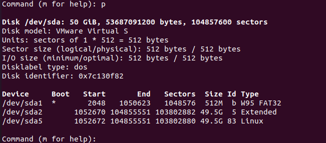

Sector size (logical/physical): 512 bytes / 512 bytes

```bash
sudo dd if=/dev/sda bs=512 count=1 2>/dev/null | xxd
```

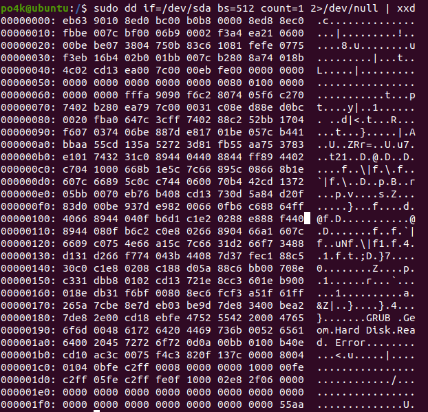

Тип таблицы - MBR. 

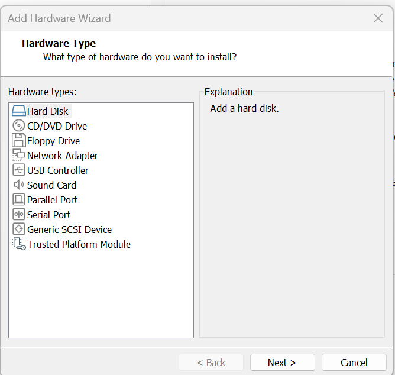

Теперь два жестких диска:
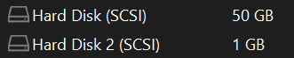

Создаю новые разделы:
```bash
sudo fdisk /dev/sdb
```
Создал разделы:

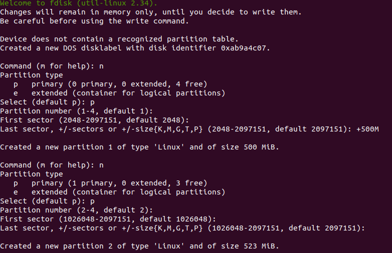

Проверил:

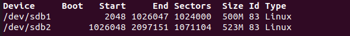

Создаю файловую систему Ext4 в sdb1:
```bash
sudo mkfs.ext4 /dev/sdb1
```
Создаю точку монтирования и примонтирую раздел:
```bash
sudo mkdir -p /mnt/ext4
sudo mount /dev/sdb1 /mnt/ext4
```
Узнал - UUID="49210136-3bb7-4946-b67c-02991b2cdd77" TYPE="ext4" PARTUUID="ab9a4c07-01" через `sudo blkid /dev/sdb1`


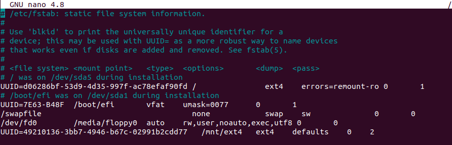

` sudo mount -a ` не вывел ошибки и через `df -h` убедился в этом

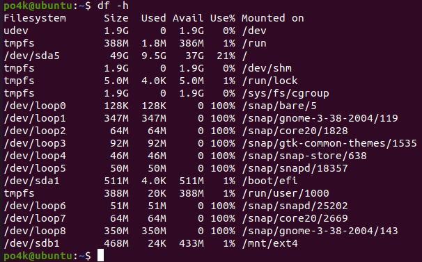

3. На втором разделе создать логический том (LVM). Создать файловую систему XFS и примонтировать к папке /mnt/xfs
```bash
sudo pvcreate /dev/sdb2 # создаю физический том PV
sudo vgcreate vg_data /dev/sdb2 # создаю группу томов VG
sudo lvcreate -n lv_xfs -l 100%FREE vg_data # создаю логический том LV, используя 100% места в VG
sudo mkfs.xfs /dev/mapper/vg_data-lv_xfs # созда юфайловую систему XFS
sudo mkdir -p /mnt/xfs # создаю точку монтирования XFS
sudo mount /dev/mapper/vg_data-lv_xfs /mnt/xfs
```

Тома создались правильно

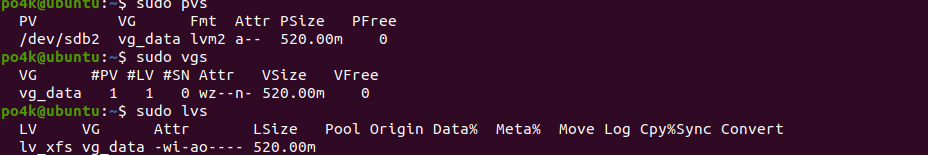

4. Создать файл размером 1 Гб, создать на нём раздел LVM. Добавить его в группу томов из задания 2. Выяснить последствия (pvs). Попробовать расширить раздел за счёт нового пространства.

Создаю файл размером 1Гб:
```bash
sudo dd if=/dev/zero of=/loopfile.img bs=1M count=1024
```
Использую его как блочное устройство
```bash
sudo losetup -fP /loopfile.img
```
Создаем физический том на нем

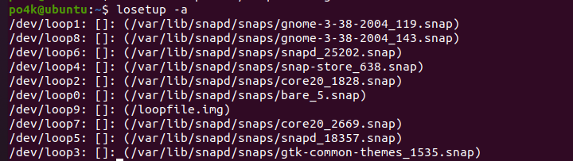
```bash
sudo pvcreate /dev/loop9
```
Расширяем группу томов и проверяем:
```bash
sudo vgextend vg_data /dev/loop9
```

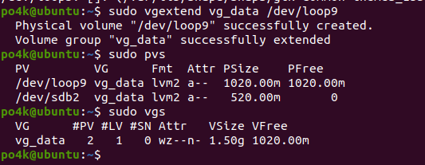

При создании я использовал 100% и свободного места в VG не осталось. Сначала расширю LV
```bash
sudo lvextend -r -L +500M /dev/mapper/vg_data-lv_xfs
```
-r для увеличения файловой системы одновременно 

5. Создать файл /mnt/ext4/file1 и наполнить его произвольным содержимым. Скопировать его в le2. Создать символическую ссылку file3 на file1. Создать жёсткую ссылку file4 на file1. Посмотреть, какие inode у файлов. Удалить le1. Что стало с остальными созданными файлами? Попробовать вывести их на экран.

- **Жесткая ссылка** — это дополнительное имя для того же самого inode (файла). Удаление оригинала не влияет на жесткую ссылку.
- **Символическая ссылка** — это отдельный файл, который содержит путь к целевому файлу. Удаление оригинала "ломает" символическую ссылку.

Создал файл и скопировал его
```bash
sudo sh -c 'echo "Это содержимое file1" > /mnt/ext4/file1'
sudo cp /mnt/ext4/file1 /mnt/ext4/file2
```
Символическая ссылка
```bash
sudo ln -s /mnt/ext4/file1 /mnt/ext4/file3
```
Жесткая ссылка
```bash
sudo ln /mnt/ext4/file1 /mnt/ext4/file4
```
Incode:
```bash
ls -li /mnt/ext4/file*
```

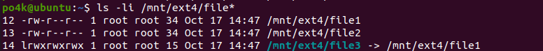

Удалю файл

```bash
sudo rm /mnt/ext4/file1
```
Проверка 

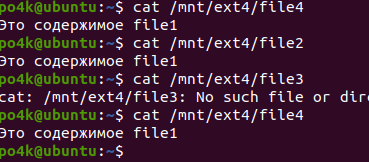

file2 цел - назависимая копия
file3 ошибка - это путь
file4 цел - ссылка указывает на тот же incode

6. Создать ссылку вида /mnt/xfs/link, по которой будет доступен /mnt/ext4/file4

Создаю символическую ссылку
```bash
sudo ln -s /mnt/ext4/file4 /mnt/xfs/link
```
Проверяю

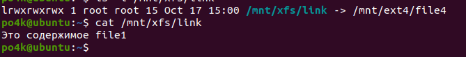

Дополнительные скриншоты

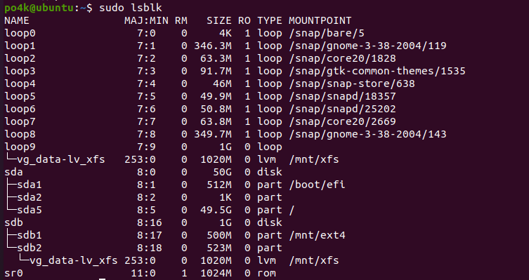
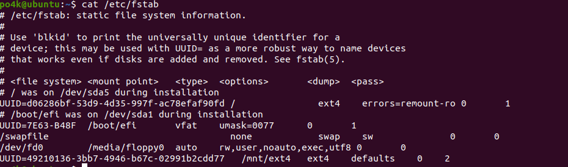